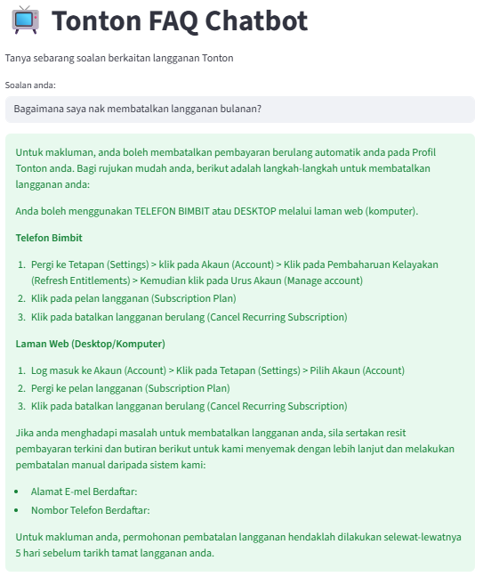

# 📺 Tonton FAQ Chatbot

A Retrieval-Augmented Generation (RAG) chatbot that answers questions about Tonton subscriptions based on a custom FAQ knowledge base. Built using **LangChain**, **FAISS**, and **Streamlit**, with responses powered by **Gemini v2.5 Flash API**.

---

## Features

- Load FAQ documents, chunk text, and create embeddings using HuggingFace.
- Store embeddings in **FAISS** for fast similarity search.
- Retrieve relevant chunks for user queries.
- Generate answers conditioned on retrieved content using Gemini API.
- Streamlit web interface for interactive Q&A.
- Input validation to prevent malicious queries.

---

## Screenshot



---

## Getting Started

### 1. Clone the repo

```bash
git clone https://github.com/nabila-zurain/tonton-faq-chatbot.git
cd tonton-faq-chatbot
````

### 2. Install dependencies

```bash
pip install -r requirements.txt
```

### 3. Prepare the vector database

```bash
python ingest.py
```

This will create a FAISS vector store in the `faiss_index/` folder.

### 4. Set Gemini API key securely

Create a folder `.streamlit` in the repo root and a file `secrets.toml` inside it:

```toml
# .streamlit/secrets.toml
GEMINI_API_KEY = "YOUR_GEMINI_KEY"
```

### 5. Run the Streamlit app

```bash
streamlit run app.py
```

Access it locally at `http://localhost:8501`.

---

## Deployment

The app is also deployed on **Streamlit Cloud**:
[https://tonton-faq-chatbot-2fqw7ajahx6jnwbdjzwcrx.streamlit.app/](https://tonton-faq-chatbot-2fqw7ajahx6jnwbdjzwcrx.streamlit.app/)

---

## Project Structure

```
rag-chatbot/
├── app.py              # Main Streamlit app
├── ingest.py           # Script to load, split, embed, and save FAQ
├── faiss_index/        # FAISS vector store
├── requirements.txt    # Dependencies
├── screenshot.png      # Screenshot of chatbot UI
└── README.md
```

---

## Notes

* Preferably use **Gemini v2.5 Flash API** for responses.
* Ensure your API key is set in `st.secrets` to avoid exposing it in GitHub.
* The code is modular and documented for clarity.
* FAISS is used for vector-based retrieval of relevant FAQ content.
* The chatbot only answers based on the FAQ; if info is missing, it replies:
  `"Maaf, maklumat tidak ditemui dalam FAQ."`
